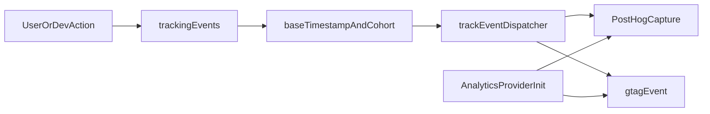

# Intent Review and Implementation Priorities

This document captures the latest thorough review of intent, architecture, and delivery gaps for GMF Analytics System.

## Objective and intent fidelity

GMF Analytics System is clearly positioned as an intent-driven UX optimization product with `intent_to_click_rate` as the north-star metric.

Current implementation fidelity is strong for metric semantics and tracking architecture, but partial for production instrumentation coverage.

## Current architecture summary

## Key validated strengths

- Metric definition is consistent across `AGENTS.md`, `docs/03-tight-core.md`, and `docs/metrics.md`.
- Event taxonomy is typed and explicit (`cta_click_ticket`, `engagement_scroll`, `content_view_artist`).
- Dispatcher is centralized and SSR-safe (`src/tracking/dispatcher.ts`).
- CI quality gate exists for lint and build (`.github/workflows/ci.yml`).
- Commit message standards are enforced via Husky + commitlint.

## Risk register (ordered)

### P0 risks

1. **Cohort attribution drift**: cohort is derived from current URL params at event time and is not persisted.
2. **Instrumentation coverage gap**: observed event firing is currently centered in internal dashboard dev buttons, not full production user journey hooks.

### P1 risks

3. **No automated tracking tests**: no test suite currently validates event contracts, cohort logic, or dispatcher behavior.
4. **Environment guidance inconsistency**: `NEXT_PUBLIC_POSTHOG_KEY` is described as mandatory in one place and recommended in another.

### P2 risks

5. **Consent/privacy governance gap**: analytics providers initialize immediately when env vars are present.
6. **Operational completeness gap**: production deploy and linked PostHog insight remain open checklist items.

## Next-run implementation order (strict)

Use this exact sequence in the next implementation run.

1. **Persist first-touch cohort and read from persistence in event base metadata**
   - Files: `src/tracking/cohort.ts`, `src/tracking/events.ts`, `src/tracking/types.ts` (if needed).
   - Outcome: stable cohort assignment for funnel segmentation after landing-page params disappear.

2. **Add production instrumentation hooks for real CTA and scroll behavior**
   - Files: route/components where users perform ticket CTA and scroll interactions.
   - Keep `src/dashboard/Dashboard.tsx` dev buttons as internal QA triggers only.
   - Outcome: `intent_to_click_rate` reflects real user behavior.

3. **Add automated tests for tracking contract**
   - Files: new tests for `src/tracking/cohort.ts`, `src/tracking/events.ts`, `src/tracking/dispatcher.ts`.
   - Outcome: regressions in event names/properties/cohort logic are caught in CI.

4. **Unify documentation requirements for analytics env vars**
   - Files: `AGENTS.md`, `docs/ROADMAP.md`, `README.md`, `.env.example`.
   - Outcome: one consistent statement of required vs optional variables.

5. **Implement consent/privacy gating for analytics bootstrap**
   - File: `src/components/AnalyticsProvider.tsx` (plus any consent state source).
   - Outcome: explicit governance path before PostHog/GA init.

6. **Close operational checklist items**
   - Files/docs: `docs/ROADMAP.md`, deployment config and environment docs.
   - Outcome: production deploy wired and dashboard insight link configured.

## Acceptance criteria for next run

- Cohort is deterministic and persisted.
- Real UX emits required events without relying on manual dashboard triggers.
- Tracking tests run in CI and pass.
- Docs are internally consistent on env requirements.
- Analytics initialization respects explicit consent policy.
- Roadmap open items for deploy and insight URL are complete or actively tracked with owners.
